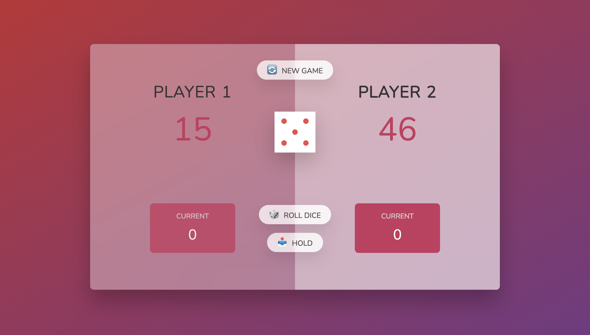
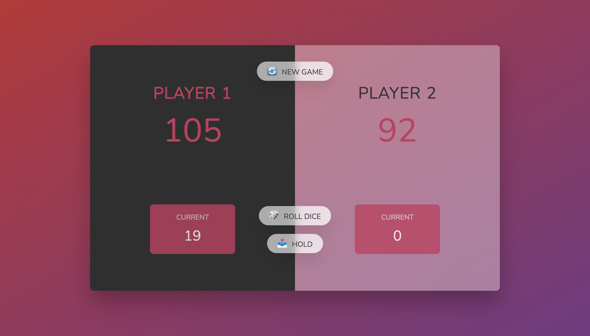

# Game Screen

[NewGame](images/new-game.png)

Another day in my #50daysofCode Challenge -
I wanted to take a spin on the common vanilla JavaScript project "Dice Game". This game has more functionality and a bit more complexion in it's decision making.

Functionality

- User rolls dice with random result.
- With every roll the score goes up, until you roll a 1. (which resets your score)
- You can risk rolling a 1 or hold your current score, giving your opponent an opportunity to do the same.
- The score you hold on during your turn is added to your final score. First player to 100 wins.
- Option to reset the game as well.
